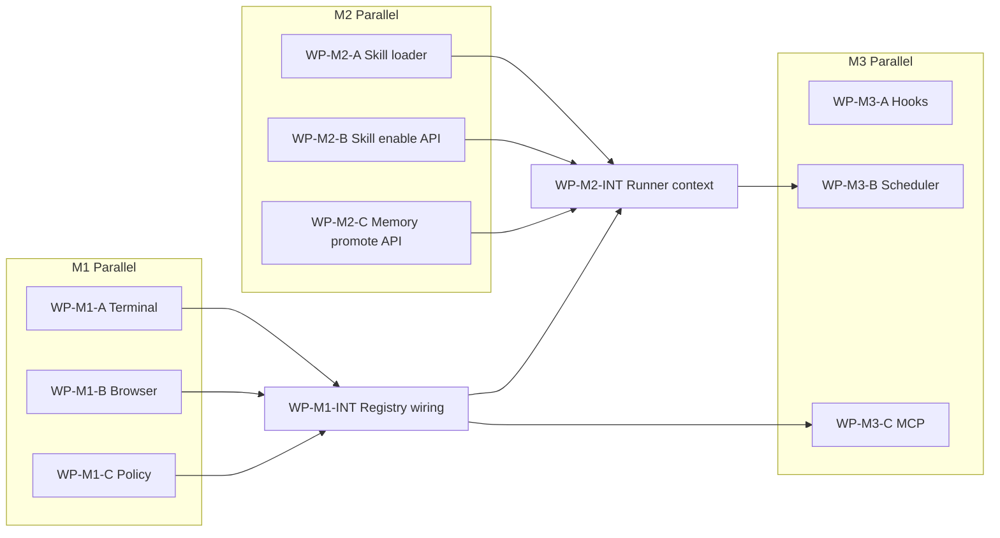

# Parallel Development Tracks Plan

> **For agentic workers:** Each work package (WP) below is designed for **one agent / one branch**. Use superpowers:subagent-driven-development or a dedicated worktree per WP. Do not start a WP without reading `AGENTS.md`, `specs/long-term-roadmap.md`, and the linked phase spec (create if missing).

**Goal:** Split post-Phase-6b work into **decoupled, parallelizable** packages with clear file boundaries, dependencies, and acceptance tests.

**Architecture:** M1 tool adapters touch only `src/agent_factory/tools/` plus thin registry wiring; M2 learning touches `skills/`, `memory/`, `api/`; M3 autonomy touches new `hooks/`, `scheduler/`, `mcp/` packages; M4 team is sequential. Integration WPs are explicit.

**Tech Stack:** Python 3.11+, pytest, existing `PermissionGuard` / `ToolRegistry` / `AgentRunner`.

---

## Current Baseline

- **Tests:** `python -m pytest tests/unit -v` → 60 passed
- **Do not regress:** Phases 0–6b behavior
- **Stable integration points:**
  - `ToolRegistry.execute(tool, operation, target, content=...)`
  - `PermissionGuard.evaluate(ToolRequest)`
  - `AgentRunner.run()` / `continue_from_approval()`
  - `RunTrace.append(event_type, data)`

---

## Dependency Graph



---

## Work Package Index

| WP ID | 名称 | 并行组 | 依赖 | 主要目录（独占） |
|-------|------|--------|------|------------------|
| WP-M1-A | Terminal adapter | M1 | 无 | `tools/terminal.py`, `tests/unit/tools/test_terminal.py` |
| WP-M1-B | Browser adapter | M1 | 无 | `tools/browser.py`, `tests/unit/tools/test_browser.py` |
| WP-M1-C | Policy loader | M1 | 无 | `config/policy_loader.py`, `tests/unit/config/test_policy_loader.py` |
| WP-M1-INT | Tool registry 集成 | M1 后 | M1-A/B/C | `tools/registry.py`, `tools/__init__.py`, 少量 `runner.py` |
| WP-M2-A | Skill loader | M2 | M1-INT 可选 | `skills/loader.py`, `skills/index.py` |
| WP-M2-B | Skill enable API/UI | M2 | WP-M2-A 接口 | `api/routes/skills.py`, `apps/web/` |
| WP-M2-C | Memory promotion API | M2 | 无 | `memory/promote.py`, `api/routes/memory.py` |
| WP-M2-INT | Runner 注入 skills | M2 后 | M2-A | `runtime/runner.py`, `llm/messages.py` |
| WP-M3-A | Hooks 子系统 | M3 | 无 | `hooks/` 新包 |
| WP-M3-B | Scheduler | M3 | M1-INT | `scheduler/` 新包 |
| WP-M3-C | MCP → Registry | M3 | M1-INT | `mcp/` 新包 |
| WP-M4-A | Team schema | M4 | M2-INT | `config/team_schema.py` |
| WP-M4-B | Message bus | M4 | M4-A | `team/bus.py` |
| WP-M4-C | Team runner | M4 | M4-B | `team/runner.py` |
| WP-M5-A | CLI entrypoints | M5 | M2-INT | `cli.py`, `scripts/` |

---

## M1 — Tool Surface (Parallel)

### WP-M1-A: Terminal Adapter

**Goal:** Atomic terminal execution inside sandbox cwd; no shell injection patterns in MVP.

**Files:**
- Create: `src/agent_factory/tools/terminal.py`
- Create: `tests/unit/tools/test_terminal.py`
- Spec: `specs/phase-7a-terminal-tool.md` (agent creates before code)

**Interface contract (freeze first PR if splitting work):**

```python
# terminal.py — execute(operation, target, content) -> ToolResult
# operation: "run" only in MVP
# target: command string
# deny list: rm -rf, curl|bash pipelines, etc. (configurable tuple)
```

**Acceptance:**
- [ ] Unit tests with `subprocess` mocked
- [ ] cwd locked to workspace
- [ ] Registry registers tool name `terminal`
- [ ] Guard still required before execute (runner unchanged in this WP)

**Do NOT:** Change `PermissionGuard` deny rules beyond tests; no Web UI.

---

### WP-M1-B: Browser Adapter

**Goal:** Atomic read/navigate via injectable fetcher (tests) and optional Playwright later.

**Files:**
- Create: `src/agent_factory/tools/browser.py`
- Create: `tests/unit/tools/test_browser.py`
- Spec: `specs/phase-7b-browser-tool.md`

**MVP operations:**
- `read` — fetch URL text (HTTP GET or mock)
- `navigate` — alias of read for MVP

**Acceptance:**
- [ ] Injectable fetcher for tests (no network in CI)
- [ ] `submit` not implemented in adapter — guard returns confirm, runner blocks

**Do NOT:** Add Playwright dependency without separate WP approval.

---

### WP-M1-C: Policy Loader

**Goal:** Merge `configs/policies/default.yaml` (or agent-referenced policy) into runtime `PermissionsConfig`.

**Files:**
- Create: `src/agent_factory/config/policy_loader.py`
- Modify: `src/agent_factory/config/loader.py` (optional `policy: default` field)
- Create: `tests/unit/config/test_policy_loader.py`
- Spec: `specs/phase-7c-policy-loader.md`

**Acceptance:**
- [ ] Agent YAML can reference policy by name
- [ ] Deny/confirm/sandbox merge rules documented in spec
- [ ] Fail closed on missing policy file

**Do NOT:** Change tool adapters.

---

### WP-M1-INT: Registry Integration (Integrator only)

**Goal:** Register terminal + browser; wire policy loader at run start.

**Files:**
- Modify: `src/agent_factory/tools/registry.py`
- Modify: `src/agent_factory/runtime/runner.py` (minimal)
- Extend: `tests/unit/runtime/test_runner.py` (1–2 integration cases)

**Acceptance:**
- [ ] Allowed terminal run produces `tool_executed` trace
- [ ] Full suite 60+ tests pass

**Merge order:** After M1-A, M1-B, M1-C merged to `master`.

---

## M2 — Learning Loop (Parallel with care)

### WP-M2-A: Skill Loader

**Goal:** Load enabled skills from `configs/skills/*/SKILL.md` into a list for runner/LLM context.

**Files:**
- Create: `src/agent_factory/skills/loader.py`
- Create: `src/agent_factory/skills/index.py`
- Create: `tests/unit/skills/test_loader.py`

**Acceptance:**
- [ ] Parses YAML frontmatter + body
- [ ] Unknown skill names in agent config → warning in trace

**Do NOT:** Auto-enable drafts.

---

### WP-M2-B: Skill Enable API/UI

**Goal:** Promote draft from `.agent-factory/skills/drafts/` to `configs/skills/` after human review.

**Files:**
- Modify: `src/agent_factory/skills/review.py`
- Create: `src/agent_factory/api/routes/skills.py` (or extend server)
- Modify: Web static UI (if under repo)
- Create: `tests/unit/api/test_skills_api.py`

**Acceptance:**
- [ ] `POST /api/skills/drafts/{id}/enable` copies SKILL.md + sets review status
- [ ] Enabled skill appears in loader output

**Do NOT:** Modify `AgentRunner` loop logic (M2-INT).

---

### WP-M2-C: Memory Promotion API

**Goal:** Confirm project/user memory candidates into `.agent-factory/memory/project|user/`.

**Files:**
- Create: `src/agent_factory/memory/promote.py`
- Create: `api/routes/memory.py`
- Create: `tests/unit/memory/test_promote.py`

**Acceptance:**
- [ ] Session memory still auto-archived
- [ ] Project/user only written after API confirm

---

### WP-M2-INT: Runner Context Injection

**Integrator WP** — depends M2-A.

**Files:**
- Modify: `src/agent_factory/runtime/runner.py`
- Modify: `src/agent_factory/llm/messages.py` or litellm adapter

**Acceptance:**
- [ ] Trace event `skills_loaded` with skill names
- [ ] Fake LLM test asserts skill text in request

---

## M3 — Autonomy & Plugins (Highly parallel)

### WP-M3-A: Hooks

**New package:** `src/agent_factory/hooks/`

**MVP events:** `PreToolUse`, `PostToolUse`, `RunCompleted`

**Acceptance:**
- [ ] Hook config in agent YAML (mock → real)
- [ ] Hook failure blocks tool or run (fail-closed, spec-defined)

**No dependency on M2.**

---

### WP-M3-B: Scheduler

**New package:** `src/agent_factory/scheduler/`

**Acceptance:**
- [ ] Interval trigger starts run with task text from YAML
- [ ] Run artifacts under `.agent-factory/runs/`

**Depends:** Stable `AgentRunner.run()` (already).

---

### WP-M3-C: MCP Tool Routing

**New package:** `src/agent_factory/mcp/`

**Acceptance:**
- [ ] MCP tool descriptors map to `ToolRequest`
- [ ] All calls through `PermissionGuard`

**Depends:** M1-INT for registry patterns.

---

## M4 — Team (Sequential — not parallel internally)

| Order | WP | Output |
|-------|-----|--------|
| 1 | WP-M4-A | `team` section schema + validation |
| 2 | WP-M4-B | In-memory/async mailbox |
| 3 | WP-M4-C | Multi-agent demo |

Only **one agent** should work on M4 at a time.

---

## M5 — Productization (Parallel)

### WP-M5-A: Unified CLI

- `agent-factory chat`, `run`, `demo`, `serve`
- Entry in `pyproject.toml` `[project.scripts]`

Can parallel with M3 if no shared files.

---

## Multi-Agent Assignment Template

Copy into issue or agent prompt:

```markdown
## Assignment: WP-M1-A Terminal Adapter

- Branch: feature/wp-m1-a-terminal
- Read: AGENTS.md, specs/long-term-roadmap.md, specs/phase-7a-terminal-tool.md
- Own only: src/agent_factory/tools/terminal.py, tests/unit/tools/test_terminal.py
- Do not edit: runner.py, registry.py (Integrator WP-M1-INT)
- Done when: pytest tests/unit/tools/test_terminal.py -v passes; spec updated to Implemented
```

---

## Verification Commands

| Scope | Command |
|-------|---------|
| Single WP | `python -m pytest tests/unit/<area> -v` |
| Pre-merge | `python -m pytest tests/unit -v` |
| Local API smoke | `python scripts/run_local_api.py` |

---

## Self-Review

- [x] Each parallel WP has exclusive primary directories
- [x] Integration WPs explicitly named (M1-INT, M2-INT)
- [x] M4 marked sequential
- [x] No placeholder TBD in acceptance criteria
- [x] Aligns with `specs/long-term-roadmap.md` milestones M1–M5
