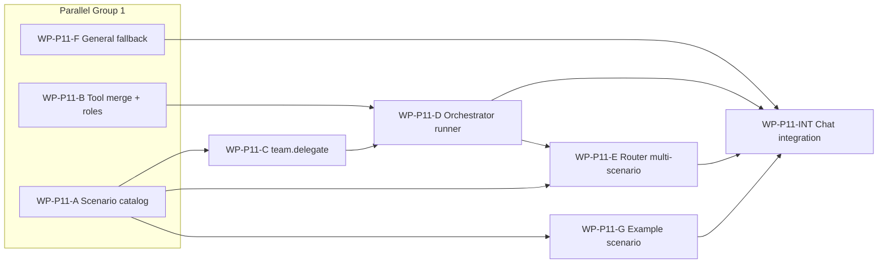

# Phase 11 Scenario Teams — Implementation Plan

> **For agentic workers:** Each WP below maps to one branch / one subagent (`.cursor/agents/wp-p11-*.md`). Read `AGENTS.md`, `specs/phase-11-agent-team-architecture.md`, then your WP spec before coding.

**Goal:** Scenario-based agent teams with read-only Orchestrator, dynamic `team.delegate`, LLM Router (single agent | scenario | multi-scenario parallel), summary-only aggregation, and `general_assistant` fallback.

**Baseline:** `python -m pytest tests/unit -v` → **121 passed**（Phase 11 complete; was 98 after Phase 10).

**Single source of truth:** `specs/phase-11-agent-team-architecture.md`

---

## Dependency Graph



---

## Work Package Index

| WP ID | 名称 | 并行组 | 依赖 | 主要目录（独占） |
|-------|------|--------|------|------------------|
| WP-P11-A | Scenario schema + catalog | P11-1 | 无 | `config/scenario_schema.py`, `config/scenario_catalog.py`, `tests/unit/scenarios/` |
| WP-P11-B | Common/scenario tool merge + role templates | P11-1 | 无 | `config/tool_merge.py`, `config/role_templates.py`, `configs/tools/common.yaml` |
| WP-P11-F | General assistant fallback | P11-1 | 无 | `configs/agents/general_assistant.yaml`, `tests/unit/routing/test_fallback.py` |
| WP-P11-C | `team.delegate` tool | P11-2 | P11-A | `tools/team_delegate.py`, `team/bus.py`（扩展）, `tests/unit/tools/test_team_delegate.py` |
| WP-P11-D | Orchestrator dynamic runner | P11-2 | P11-A, B, C | `team/orchestrator_runner.py`, `tests/unit/team/test_orchestrator_runner.py` |
| WP-P11-E | Router multi-scenario + summary merge | P11-3 | P11-A, D | `routing/scenario_resolver.py`, `runtime/multi_scenario.py`, `tests/unit/routing/` |
| WP-P11-G | Example `research-report` scenario | P11-3 | P11-A | `configs/scenarios/research-report/**` |
| WP-P11-INT | `run_chat` integration | P11-4 | P11-D, E, F, G | `runtime/chat.py`, `routing/resolver.py`, 集成测 |

**Integrator only:** `runtime/chat.py`, `routing/resolver.py`（除非 WP 明确授权）。

---

## WP-P11-A: Scenario Schema + Catalog

**Goal:** Load `configs/scenarios/<scenario_id>/scenario.yaml`; expose `ScenarioCatalog` for Router.

**Files:**
- Create: `src/agent_factory/config/scenario_schema.py`
- Create: `src/agent_factory/config/scenario_catalog.py`
- Create: `tests/unit/scenarios/test_scenario_catalog.py`

**Contract:**

```python
@dataclass
class ScenarioEntry:
    scenario_id: str
    display_name: str
    description: str
    root: Path
    orchestrator_path: Path
    member_paths: dict[str, Path]  # member_id -> yaml
```

**Acceptance:**
- [x] Parses `id`, `display_name`, `description`, `entry`, optional `single_agent_fallback`
- [x] Lists all scenarios under `configs/scenarios/`
- [x] Invalid duplicate `scenario_id` → fail closed

**Do NOT:** Change `run_chat` or Router.

---

## WP-P11-B: Tool Merge + Role Templates

**Goal:** Merge `configs/tools/common.yaml` + scenario `tools.yaml` + member `tools:`; apply orchestrator/teammate role deny sets.

**Files:**
- Create: `src/agent_factory/config/tool_merge.py`
- Create: `src/agent_factory/config/role_templates.py`
- Create: `configs/tools/common.yaml`
- Create: `tests/unit/config/test_tool_merge.py`

**Merge rule:** Global unique tool names; scenario tools only valid when loading agents under that scenario root.

**Orchestrator template:** disable filesystem write, terminal, http non-GET, browser submit; allow `team` delegate, optional filesystem read.

**Acceptance:**
- [x] Orchestrator effective tools exclude write adapters
- [x] Teammate can enable scenario-specific tools

**Do NOT:** Register new tool adapters (P11-C).

---

## WP-P11-F: General Assistant Fallback

**Goal:** Router fallback → `general_assistant`; out-of-scope tasks get honest「做不到」reply.

**Files:**
- Modify: `configs/agents/general_assistant.yaml` (system_prompt)
- Create: `tests/unit/routing/test_general_fallback.py`

**Acceptance:**
- [x] Scripted LLM: impossible task → FinalResponse with decline semantics, no tool calls
- [x] Router resolver returns `general_assistant` when decision kind is fallback

**Do NOT:** Change team runtime.

---

## WP-P11-C: `team.delegate` Tool

**Goal:** Atomic delegate via MessageBus; extend messages with `scenario_id`.

**Files:**
- Create: `src/agent_factory/tools/team_delegate.py`
- Modify: `src/agent_factory/team/bus.py` (optional `scenario_id` on messages)
- Modify: `src/agent_factory/tools/registry.py` (register `team` adapter)
- Create: `tests/unit/tools/test_team_delegate.py`

**Contract:**

```python
# tool=team, operation=delegate
# target JSON: {"receiver": "researcher", "task": "...", "scenario_id": "research-report"}
```

**Acceptance:**
- [x] Delegate creates Bus message with `message_id`
- [x] PermissionGuard path for orchestrator role allows delegate only

**Do NOT:** Implement full Orchestrator loop (P11-D).

---

## WP-P11-D: Orchestrator Dynamic Runner

**Goal:** Replace fixed pipeline as primary path; Orchestrator LLM loop with delegate + guards.

**Files:**
- Create: `src/agent_factory/team/orchestrator_runner.py`
- Create: `tests/unit/team/test_orchestrator_runner.py`

**Acceptance:**
- [x] Scripted LLM: two delegates → `run_completed` + `summary.md`
- [x] `max_delegations` exceeded → blocked/failed with trace
- [x] Duplicate `(receiver, task_hash)` → warning or deny
- [x] Trace includes `scenario_id`, `message_id` on delegate events
- [x] Orchestrator run has no `tool_executed` for filesystem write

**Do NOT:** Modify Router (P11-E).

---

## WP-P11-E: Router Multi-Scenario + Summary Merge

**Goal:** LLM routing `decision_kind`; parallel team runs; merge **only** `summary.md` per run.

**Files:**
- Create: `src/agent_factory/routing/scenario_resolver.py`
- Create: `src/agent_factory/runtime/multi_scenario.py`
- Extend: `src/agent_factory/routing/decision.py` (`RoutingDecision` fields)
- Create: `tests/unit/routing/test_multi_scenario.py`

**RoutingDecision extension:**

```python
decision_kind: Literal["single_agent", "scenario", "multi_scenario", "fallback"]
scenario_id: str | None
subtasks: tuple[ScenarioSubtask, ...]  # scenario_id + task
correlation_id: str | None
```

**Summary merge:** Use `WorkspaceStore` or internal helper to read `.agent-factory/runs/<run_id>/summary.md` only — **not** trace.jsonl or artifacts.

**Acceptance:**
- [x] Parallel two scenarios → two run dirs with summaries → merged LLM reply
- [x] Fallback kind → `general_assistant` (P11-F)

**Do NOT:** Wire into `run_chat` (P11-INT).

---

## WP-P11-G: Example Scenario `research-report`

**Goal:** Migrate demo from `configs/teams/research_report.yaml` to full scenario layout.

**Files:**
- Create: `configs/scenarios/research-report/scenario.yaml`
- Create: `configs/scenarios/research-report/orchestrator.yaml`
- Create: `configs/scenarios/research-report/members/researcher.yaml`
- Create: `configs/scenarios/research-report/members/writer.yaml`
- Optional: `configs/scenarios/research-report/tools.yaml`

**Acceptance:**
- [x] `ScenarioCatalog` loads scenario; orchestrator has delegate only; members have write tools
- [x] Phase 10 pipeline test still passes (unchanged `configs/teams/`)

---

## WP-P11-INT: Chat Integration

**Goal:** `run_chat` uses extended Router; scenario + multi-scenario paths; preserves single-agent path.

**Files:**
- Modify: `src/agent_factory/runtime/chat.py`
- Modify: `src/agent_factory/routing/resolver.py` (LiteLLM + rule adapters)
- Create: `tests/unit/runtime/test_chat_scenario.py`

**Acceptance:**
- [x] Existing chat tests pass
- [x] New: scenario route starts orchestrator run
- [x] New: multi-scenario produces correlation_id in routing trace
- [x] Full suite: `python -m pytest tests/unit -v`

**Merge order:** After P11-D, E, F, G.

---

## Recommended Execution Order

```text
Week 1 (parallel):
  WP-P11-A, WP-P11-B, WP-P11-F

Week 2 (parallel after A):
  WP-P11-C, WP-P11-G

Week 3 (sequential):
  WP-P11-D → WP-P11-E

Week 4:
  WP-P11-INT
```

---

## Verification Commands

| Scope | Command |
|-------|---------|
| Single WP | `python -m pytest tests/unit/<area> -v` |
| Pre-merge | `python -m pytest tests/unit -v` |

---

## Self-Review

- [x] Aligns with `phase-11-agent-team-architecture.md`
- [x] Summary-only merge for mode B
- [x] general_assistant fallback + honest decline
- [x] File ownership per WP
- [x] Integrator WP explicit
