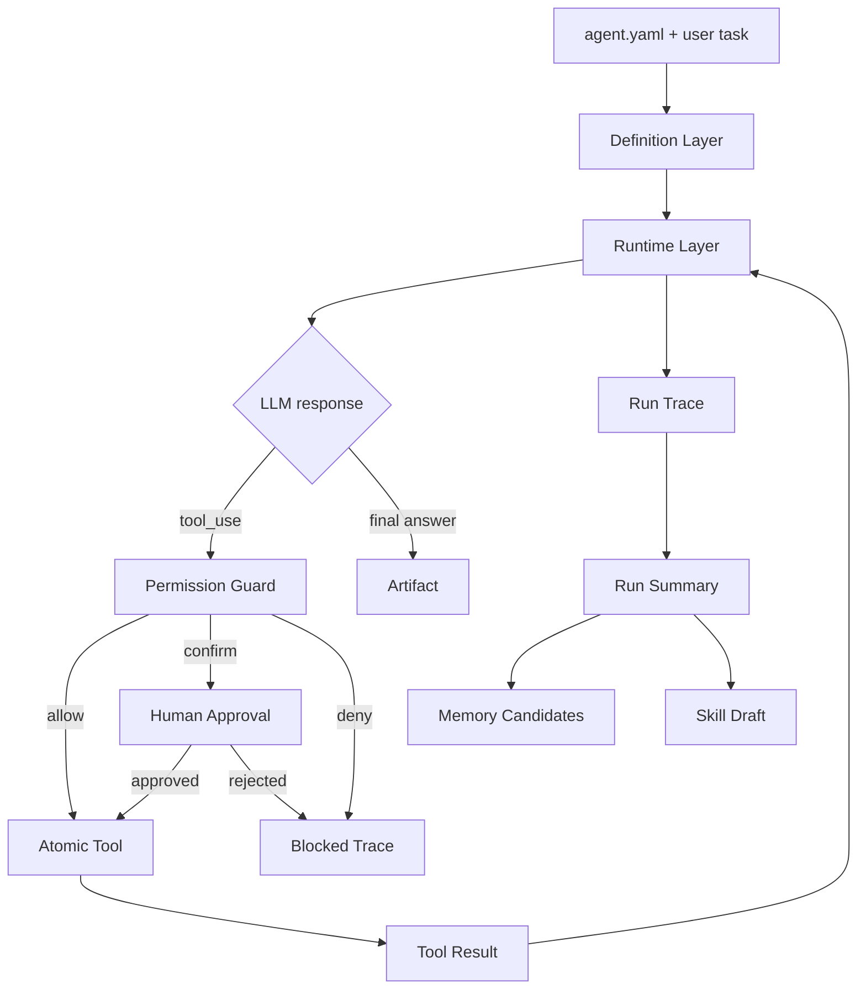

# Agent Factory 设计文档

> 更新时间：2026-05-26（初版：确认本地优先个人 Agent 工厂的 MVP 架构）
> 本文是 Agent Factory 第一阶段设计的单一真源。已确认设计写在正文；未实现能力列在 §6 TODO 和 §10 未来方向。
> 当前仓库从空目录开始，尚未进入实现阶段。

## 0. 一句话理解

Agent Factory 第一阶段是一个本地优先的个人自动化 agent harness：用 YAML 定义 agent 的身份、工具、权限和上下文边界，让单个 agent 能完成真实任务，并在任务后产出可审阅的 skill 草稿。

## 1. 对齐与阶段定位

| 维度 | 决策 |
|------|------|
| 产品形态 | 本地优先的个人助手，有 Terminal 操作、API 端点，以及简单 GUI/Web 观察界面 |
| MVP 优先级 | 先证明“配置即 Agent”：通过 YAML 快速创建并运行单个 agent |
| 首个 demo | 网页资料整理：读取网页信息，归纳总结，写入本地 Markdown 报告 |
| 首批工具 | filesystem、terminal、browser、http/api |
| 技术路线 | Python 执行核心 + TypeScript/Web UI 可选壳层 |
| 权限策略 | 沙箱优先，越界或高风险动作确认/拒绝 |
| 自学习边界 | 任务后生成 skill 草稿，等待人工审阅，不自动启用 |
| 记忆层级 | Session / Project(or Scenario) / User |

参考方向：

- `learn-claude-code`：核心启发是 harness 思维：agent loop、工具、权限、skill loading、memory、team、hooks 都围绕模型决策循环服务。
- `GenericAgent`：核心启发是极简工具集、任务轨迹沉淀、分层记忆和 skill 草稿/演化，但第一阶段不做全自动自进化。

## 2. 当前架构

### 2.1 主路径



### 2.2 六层模块

| 层 | 职责 | MVP 状态 |
|----|------|----------|
| Definition Layer | 解析 `agent.yaml`，做 schema 校验、默认值填充、unsupported/mock 字段告警 | 必做 |
| Runtime Layer | 构建上下文、执行 agent loop、调用 LLM、写 run trace | 必做 |
| Capability Layer | 提供原子工具：filesystem、terminal、browser、http | 必做 |
| Guardrail Layer | 工具启用、路径/域名沙箱、allow/confirm/deny 判断 | 必做 |
| Memory Layer | 生成 session 归档、project/user memory 候选 | 最小闭环 |
| Evolution Layer | 生成 skill draft，进入人工审阅队列 | 最小闭环 |

### 2.3 核心边界

Agent 的“智能”来自模型；本项目主要做 harness：配置、工具、上下文、权限、观测、记忆和 skill 生命周期。MVP 不用复杂工作流编排或硬编码步骤替代模型决策。

### 2.4 项目目录框架

目录分为两类：源码目录随仓库提交；运行时数据目录由本地 agent run 产生，默认不提交。

#### 2.4.1 源码目录

```text
agent-factory/
  README.md
  pyproject.toml
  package.json
  docs/
    superpowers/
      specs/
        2026-05-26-agent-factory-design.md
    architecture/
      decisions/
  configs/
    agents/
      web_researcher.yaml
    skills/
      web_research_summary/
        SKILL.md
    policies/
      default.yaml
  src/
    agent_factory/
      __init__.py
      cli.py
      config/
        loader.py
        schema.py
        defaults.py
        unsupported.py
      runtime/
        runner.py
        loop.py
        context.py
        states.py
        trace.py
      llm/
        base.py
        adapters.py
        messages.py
      tools/
        base.py
        registry.py
        filesystem.py
        terminal.py
        browser.py
        http.py
      permissions/
        policy.py
        guard.py
        sandbox.py
        approvals.py
      memory/
        store.py
        session.py
        project.py
        user.py
        candidates.py
      skills/
        loader.py
        index.py
        draft.py
        review.py
      api/
        server.py
        routes/
          runs.py
          agents.py
          skills.py
      observability/
        events.py
        logs.py
        serializers.py
  apps/
    web/
      package.json
      src/
        pages/
        components/
        api/
  tests/
    unit/
      config/
      permissions/
      tools/
    integration/
      runtime/
      demo/
  scripts/
    dev.sh
    run-demo.sh
```

#### 2.4.2 本地运行时数据目录

默认运行时目录为项目根下的 `.agent-factory/`，后续应加入 `.gitignore`。

```text
.agent-factory/
  runs/
    <run_id>/
      input.yaml
      task.md
      trace.jsonl
      summary.md
      artifact/
        report.md
      skill-draft/
        SKILL.md
      memory-candidates/
        session.md
        project.md
        user.md
  memory/
    session/
    project/
    user/
  skills/
    drafts/
    enabled/
  approvals/
    pending.jsonl
    resolved.jsonl
  logs/
```

#### 2.4.3 目录职责边界

| 路径 | 职责 | MVP 状态 |
|------|------|----------|
| `configs/agents/` | 存放可复用 agent YAML，例如首个 `web_researcher.yaml` | 必做 |
| `configs/skills/` | 存放人工维护或已审阅的 skill | 必做最小加载 |
| `configs/policies/` | 默认权限策略和 sandbox 范围 | 必做 |
| `src/agent_factory/config/` | YAML 解析、schema、默认值、unsupported 字段处理 | 必做 |
| `src/agent_factory/runtime/` | agent loop、状态机、上下文、run trace | 必做 |
| `src/agent_factory/tools/` | 原子工具实现和 registry | 必做 |
| `src/agent_factory/permissions/` | 权限判断、确认、沙箱边界 | 必做 |
| `src/agent_factory/memory/` | session 归档和 project/user 候选生成 | 最小闭环 |
| `src/agent_factory/skills/` | skill 加载、草稿生成、审阅状态 | 最小闭环 |
| `src/agent_factory/api/` | 本地 API 服务，供 Web/GUI 和 CLI 查看 run 状态 | P1 |
| `apps/web/` | 简单 Web 观察界面，不承载执行逻辑 | P1 |
| `.agent-factory/runs/` | 每次运行的 trace、artifact、summary、skill draft | 必做 |

核心不变量：

1. 源码目录不写入 run 产物；run 产物统一进入 `.agent-factory/runs/<run_id>/`。
2. 工具实现只放在 `src/agent_factory/tools/`；场景组合不进入工具层，进入 skill。
3. 权限判断只通过 `Permission Guard`，工具适配器不能绕过 `src/agent_factory/permissions/`。
4. Web UI 只调用本地 API 观察和发起任务，不直接执行工具。
5. `.agent-factory/memory/user/` 和 `.agent-factory/skills/enabled/` 的写入必须经过人工确认。

## 3. 角色、权限与边界

### 3.1 角色

| 角色 | 权限 |
|------|------|
| User | 发起任务、确认高风险动作、审阅 memory candidates 和 skill draft |
| Agent Runtime | 根据 YAML 和用户任务运行 agent loop |
| Tool Adapter | 执行单次原子能力，不内置业务流程 |
| Permission Guard | 在工具执行前做 fail-closed 权限判断 |

### 3.2 默认权限策略

| 工具 | 默认策略 |
|------|----------|
| filesystem | 允许 workspace/output 目录内读写；越界确认或拒绝 |
| terminal | 限定工作目录；危险命令拒绝；潜在写操作可确认 |
| browser | 允许读取和导航；提交表单、下载、登录态敏感动作需确认 |
| http | allowlist 域名；非 GET 或外部写操作需确认 |

权限判断顺序：

1. tool 是否在当前 agent 配置中启用。
2. 目标路径、域名或工作目录是否在沙箱范围内。
3. 是否命中 deny rule，命中即拒绝。
4. 是否命中 confirm rule，命中则请求用户确认。
5. 其余允许并记录权限决策。

## 4. MVP 协作示例

首个端到端 demo：

1. 用户提供任务：“阅读某网页并整理成 Markdown 报告”。
2. 系统加载 `agent.yaml`，得到 role、prompt、工具、权限、工作目录和输出目录。
3. Runtime 构建初始上下文，进入 agent loop。
4. 模型请求 browser/http 获取网页内容。
5. Permission Guard 检查域名和操作类型。
6. 工具执行，结果写回 messages 和 run trace。
7. 模型归纳内容，并请求 filesystem 写入 Markdown。
8. Permission Guard 检查输出路径。
9. 任务完成后生成 artifact、run summary、memory candidates 和 skill draft。
10. project/user memory 和 skill 启用均等待人工审阅。

## 5. 已确认的关键设计

### 5.1 路线选择：先跑通单 Agent

**背景**：用户目标包含 agent 创建、自学习、分级记忆、team、通信、自主行动、原子工具等多个子系统。一次性完整实现会导致第一阶段过重。

**决策**：MVP 选择轻核心 Harness，先跑通单 agent；YAML schema 可表达完整蓝图，但未实现模块只做 mock/log/unsupported。

**收益**：先得到真实可运行闭环，同时不牺牲长期系统形态。

### 5.2 YAML 是声明，不是脚本

**背景**：配置既要简单创建 agent，又不能退化成固定步骤编排器。

**决策**：`agent.yaml` 描述身份、模型、prompt、工具、权限、记忆和扩展能力；具体行动由模型在 agent loop 中根据任务和工具反馈决定。

MVP schema 分区：

| 分区 | MVP 行为 |
|------|----------|
| `meta` | 执行 |
| `agent` | 执行 |
| `runtime` | 执行 |
| `tools` | 执行 |
| `permissions` | 执行 |
| `memory` | 基础 session/project/user 路径与候选输出 |
| `skills` | 手写 skill 加载 + 任务后 draft 输出 |
| `workflow` | mock/log |
| `team` | mock/log |
| `automation` | mock/log |
| `hooks` | mock/log |
| `notifications` | mock/log |

### 5.3 工具保持原子化

**背景**：用户明确要求原子化 fc，不过度包装 fc，通过 skill 组合能力。

**决策**：filesystem、terminal、browser、http 只提供单次明确动作，不沉淀业务流程。复杂任务流程写入 skill，而不是做成新的大工具。

### 5.4 自学习采用草稿审阅制

**背景**：全自动沉淀 skill 有风险，容易把偶然成功路径固化为长期行为。

**决策**：MVP 任务结束后自动生成 skill draft，但不自动启用。人工确认适用条件、步骤和风险后，才进入 enabled skill index。

Skill 生命周期：

```text
draft -> reviewed -> enabled -> revised
```

### 5.5 三层记忆

**背景**：用户希望有分级记忆机制，但第一阶段不应过度设计复杂知识库。

**决策**：

| 层级 | 内容 | MVP 写入策略 |
|------|------|--------------|
| Session | 本次任务上下文、临时发现、未解决问题 | 默认归档 |
| Project / Scenario | 某类任务的稳定事实、目录、API、偏好流程 | 候选，人工确认 |
| User | 长期偏好、安全偏好、输出风格、常用服务 | 候选，人工确认 |

## 6. 当前 TODO

- 🔥 P0：定义 `agent.yaml` v1 schema。
  - 验收标准：能表达 meta、agent、runtime、tools、permissions、memory、skills、workflow、team、automation、hooks、notifications。
  - 不做的事：不让 workflow/team/scheduler/hooks 驱动真实执行。

- 🔥 P0：实现单 agent runtime。
  - 验收标准：给定 YAML 和任务，能进入 agent loop，调用工具，产出 artifact 和 trace。
  - 不做的事：不实现 agent team、分布式执行、多租户平台。

- 🔥 P0：实现 sandbox-first Permission Guard。
  - 验收标准：每次工具调用都有 allow/confirm/deny 决策记录；不明确时 fail closed。
  - 不做的事：不默认授予全盘文件系统、任意 shell、任意网络写权限。

- 🔥 P0：实现首个 demo。
  - 验收标准：网页资料整理并输出 Markdown 报告。
  - 不做的事：不要求自动调度或通知。

- 🔥 P1：实现 run trace、run summary、skill draft。
  - 验收标准：任务完成后生成可追溯总结和待审阅 skill 草稿。
  - 不做的事：不自动启用生成的 skill。

- 🔥 P1：提供简单 Web/GUI 或 API 观察入口。
  - 验收标准：能查看配置、运行状态、trace、artifact、skill draft。
  - 不做的事：不做多用户权限系统。

## 7. 测试需求集

核心验收场景：

1. 有效 YAML 能被解析为 runtime 配置。
2. 含 unsupported 字段的 YAML 不失败，但会记录 mock/unsupported warning。
3. 未启用工具不能被调用。
4. 文件写入越界时被拒绝或要求确认。
5. HTTP 访问非 allowlist 域名时被拒绝或要求确认。
6. 浏览器读取网页后能生成 Markdown artifact。
7. 工具异常会进入 failed/blocked trace，不伪造成功。
8. 成功任务会生成 run summary 和 skill draft。
9. skill draft 默认不进入 enabled skill index。
10. session memory 默认归档，project/user memory 只生成候选。

## 8. 测试与门控

实现阶段应至少包含：

- Schema 单元测试：有效配置、缺失字段、默认值、unsupported 字段。
- Permission Guard 单元测试：路径沙箱、域名 allowlist、deny/confirm 优先级。
- Tool adapter 单元测试：filesystem、terminal、browser、http 的最小动作。
- Runtime 集成测试：使用 fake LLM 驱动固定 tool_use 序列。
- Demo 端到端测试：网页资料整理到 Markdown artifact。

当前尚未实现代码，因此没有可执行测试命令。

## 9. 一页交接

1. 先读本文 §0-§5，理解 MVP 为什么选择轻核心单 Agent。
2. 实现时优先保证 `agent.yaml -> runtime config -> agent loop -> artifact + trace`。
3. 不要先做 team、scheduler、hooks、完整 GUI、多用户平台。
4. 所有工具调用必须经过 Permission Guard。
5. 原子工具不要承载业务流程；组合经验进入 skill。
6. skill 草稿和长期记忆写入都必须可审阅、可追溯。

## 10. 未来方向

> 状态：设计稿，非 MVP 真实执行范围。

### 10.1 Agent Team

后续通过 YAML 定义多个 agent、角色分工、inbox/outbox、handoff contract 和团队协议。MVP 只保留 schema 字段与 mock/log。

### 10.2 Agent 通信

优先考虑异步 mailbox/message bus，而不是直接共享上下文。消息需要包含 sender、receiver、task/ref、payload、status 和 trace link。

### 10.3 自主行动

通过 scheduler、hooks 或外部事件触发 agent run。第一阶段不实现真实调度，只保留配置与日志。

### 10.4 Skill 自动优化

从人工审阅的 skill 开始，逐步增加运行反馈、失败案例和版本历史。自动启用含脚本的 skill 需要额外权限模型。

### 10.5 MCP 与外部插件

后续可把 MCP server 作为外部 capability source，但仍需要统一进入 Tool Registry 和 Permission Guard。
