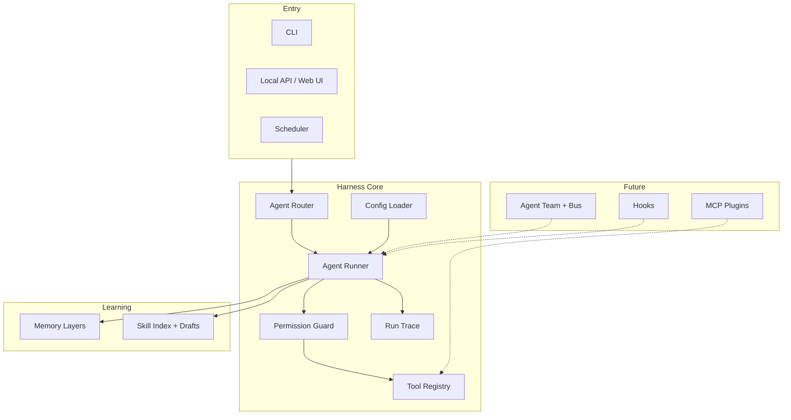

# Agent Factory 长期开发路线图

> State: Active
> Updated: 2026-05-27
> 本文是 Phase 7 及以后方向的**单一真源**。已完成阶段见 `specs/README.md`；并行任务拆分见 `docs/superpowers/plans/2026-05-27-parallel-development-tracks.md`。

## 0. 一句话

Agent Factory 已完成「单 agent + 工具 + 演示 + 学习草稿 + 本地 API + 对话路由 + 审批」的纵向切片；下一阶段在**不破坏 harness 边界**的前提下，并行补齐真实工具、学习闭环、自主调度、团队协作与插件扩展。

## 1. 当前完成度（截至 2026-05-27）

| 阶段 | 状态 | 核心能力 | 验证 |
|------|------|----------|------|
| Phase 0 | Implemented | YAML 配置、权限沙箱、run trace | `tests/unit/config`, `permissions`, `runtime/test_trace` |
| Phase 1 | Implemented | Fake/real LLM 驱动的单 agent loop | `tests/unit/runtime/test_runner.py` |
| Phase 2 | Implemented | ToolRegistry、filesystem、HTTP GET | `tests/unit/tools/` |
| Phase 3 | Implemented | 网页研究 demo、Markdown artifact | `tests/unit/runtime/test_web_research.py` |
| Phase 4 | Implemented | session 归档、memory 候选、skill 草稿 | `tests/unit/runtime/test_learning.py` |
| Phase 5 | Implemented | 只读本地 API + 最小 Web UI | `tests/unit/api/` |
| Phase 6 | Implemented | 对话路由、YAML 专家委托 | `tests/unit/runtime/test_chat.py`, `routing/` |
| Phase 6b | Implemented | 多轮 session、confirm 审批、UI 批准/拒绝 | `tests/unit/runtime/test_session_and_approval.py` |

**全量门控：** `python -m pytest tests/unit -v` → **83 passed**（含 M1–M2）

### 1.1 已有但尚未「产品级」的能力

| 能力 | 现状 | 缺口 |
|------|------|------|
| Terminal 工具 | `TerminalTool` + registry；沙箱 cwd、deny 列表 | 高级 shell 策略、allow 白名单 |
| Browser 工具 | `BrowserTool` read/navigate + injectable fetcher | Playwright、submit 实现 |
| Policy 复用 | `policy:` 引用 + `policy_loader` 合并 | 多 policy 链式继承 |
| Skill 生命周期 | loader + enable API；draft → `configs/skills/` | 自动从 run 提炼 skill |
| Memory 写入 | session 归档 + API 晋升 project/user | 向量检索、冲突合并 |
| Team / Scheduler / Hooks / MCP | schema 可 mock | 无真实执行 |

## 2. 长期目标架构（目标态）



不变量（全阶段适用）：

1. 工具保持原子化；业务流程进 skill 或 runtime 编排，不进 tool adapter。
2. 所有工具调用必须先过 `PermissionGuard`。
3. 运行产物只进 `.agent-factory/`，不进源码树。
4. 未实现能力在 YAML 中可声明，但须 trace/mock/unsupported，禁止静默忽略。

## 3. 里程碑总览

| 里程碑 | 主题 | 目标 | 建议并行度 |
|--------|------|------|------------|
| **M1** | 工具面补齐 | Terminal + Browser + Policy 加载 | **Implemented**（2026-05-27） |
| **M2** | 学习闭环 | Skill 加载/启用、Memory 晋升 | **Implemented**（2026-05-27） |
| **M3** | 自主与扩展 | Hooks、Scheduler、MCP | 高（3 条独立 track） |
| **M4** | 多 Agent 协作 | Team YAML、Message Bus、编排 | 低（强顺序依赖） |
| **M5** | 产品化 | CLI、文档、打包、可观测性 | 高 |

详细工作包编号与文件边界见：`docs/superpowers/plans/2026-05-27-parallel-development-tracks.md`。

## 4. 里程碑说明

### M1 — 工具面补齐（Phase 7）

**目标：** 让 YAML 里声明的 terminal/browser 真正能执行（在沙箱与审批约束下）。

- Terminal：仅允许工作目录内命令；危险命令 deny；默认 confirm。
- Browser：读/navigate 允许；submit/download 需 confirm；测试用 mock/fake fetcher。
- Policy：支持 agent 引用 `configs/policies/*.yaml`，合并到 `PermissionsConfig`。

**验收：** 各 adapter 有独立单测；runner 集成测；不破坏现有 60 个测试。

### M2 — 学习闭环（Phase 8）

**目标：** 任务后的草稿能被人审阅、启用，并影响后续 run。

- Skill：从 `configs/skills/` 加载 enabled skill 描述；API/UI 将 draft → reviewed → enabled。
- Memory：API/UI 将 memory-candidates 中 project/user 条目确认写入 `.agent-factory/memory/`。

**验收：** 启用 skill 后 runner 上下文可见；memory 晋升有测试与 trace。

### M3 — 自主与扩展（Phase 9）

**目标：** 定时与事件驱动 run；外部能力经 MCP 进入 registry。

- Hooks：PreToolUse/PostToolUse/RunCompleted 等最小子集；shell 命令 hook。
- Scheduler：cron/interval 触发 `AgentRunner`；配置 mock 字段变真实。
- MCP：transport 可后置；先统一 ToolRegistry 注册与权限。

**验收：** 定时任务产生 run 目录；hook 失败 fail-closed；MCP 工具走 guard。

### M4 — 多 Agent 协作（Phase 10）

**目标：** YAML 定义 team，异步 mailbox 协作。

顺序建议：schema → bus → handoff protocol → team runner。

**验收：** 两 agent 完成「研究 + 写报告」分工 demo；trace 可关联 message id。

### M5 — 产品化（Phase 11+）

- 统一 CLI（`agent-factory run|chat|demo`）
- 安装/发布（pyproject entry points）
- 可观测性（结构化日志、run 列表优化）
- 文档与示例 agent 库

## 5. 推荐实施顺序（协调视角）

```text
并行组 1（可同时进行）:
  WP-M1-A Terminal adapter
  WP-M1-B Browser adapter
  WP-M1-C Policy loader

串行闸门:
  WP-M1-INT Runner/registry 集成（依赖 M1-A/B 接口冻结）

并行组 2:
  WP-M2-A Skill loader
  WP-M2-B Skill enable API/UI
  WP-M2-C Memory promotion API/UI

并行组 3:
  WP-M3-A Hooks
  WP-M3-B Scheduler
  WP-M3-C MCP routing

串行链:
  WP-M4-A → WP-M4-B → WP-M4-C（Team）
```

## 6. 多 Agent 协作开发约定

1. **一工作包一分支：** `feature/wp-<id>-<short-name>`，从最新 `master` 拉出。
2. **一工作包一 spec：** 在 `specs/` 新建 `phase-N-<topic>.md` 或在工作包文档中链接。
3. **文件所有权：** 见 parallel-development-tracks 中的「主要目录」列；禁止两个 agent 同时改 `runner.py` 除非指定集成 agent。
4. **集成角色：** 每并行组指定一个 **Integrator** agent，在子包 merge 后跑全量测试并修冲突。
5. **接口先行：** 若两包都依赖 runner，先合并「仅 dataclass/protocol + 空实现」的 PR，再并行实现。

## 7. 与原始愿景的对照

| 用户原始能力 | 当前 | 下一里程碑 |
|--------------|------|------------|
| YAML 快速创建 agent | 已具备 | M5 示例库 |
| 自学习 / skill | 草稿 | M2 启用闭环 |
| 分级记忆 | session + 候选 | M2 晋升 |
| Agent team | mock | M4 |
| Agent 通信 | 无 | M4 |
| 自主行动 | 无 | M3 Scheduler |
| 原子化 FC | filesystem/http | M1 terminal/browser |
| 简单 GUI/API | 已具备 | M5 增强 |

## 8. 文档维护

- 完成某里程碑后：新增或更新 `specs/phase-N-*.md`，并将本表状态改为 Implemented。
- 新增并行工作包：只改 `docs/superpowers/plans/2026-05-27-parallel-development-tracks.md`，避免本文件膨胀。
