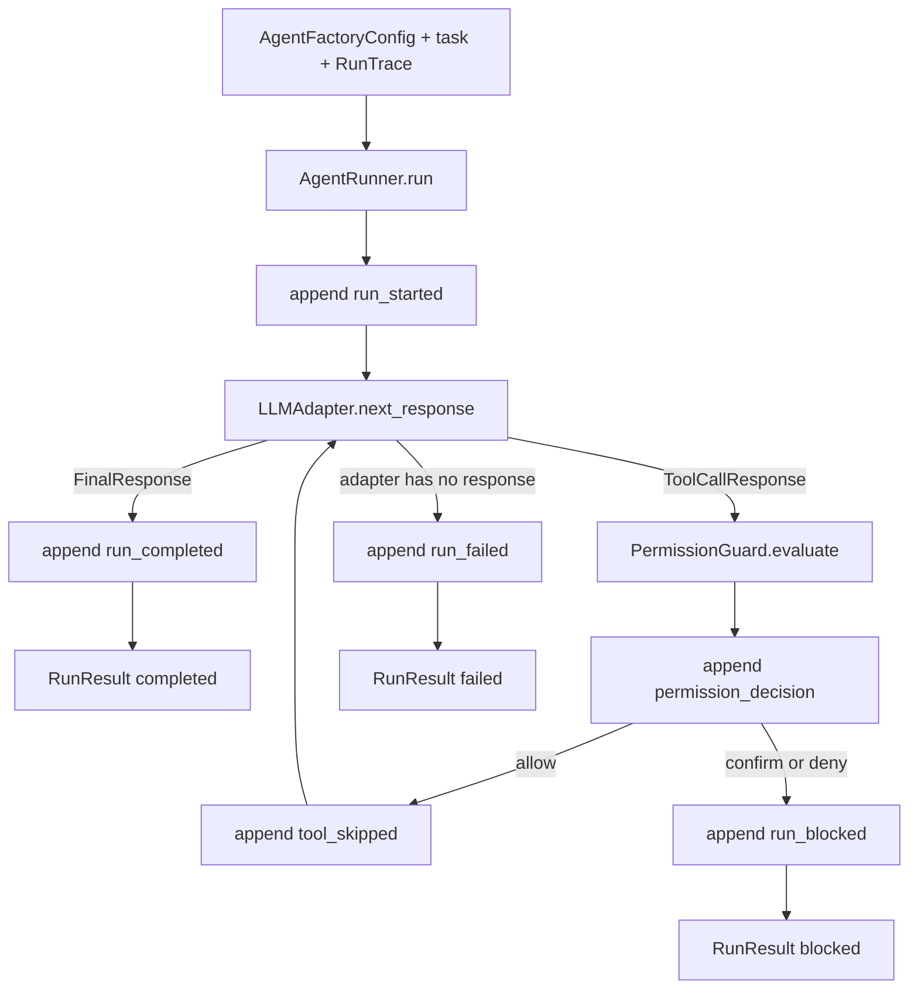

# Phase 1 Single-Agent Runtime Spec

> State: Implemented
> Updated: 2026-05-27
> This spec is the durable handoff for connecting Phase 0 config, permissions, and trace primitives into a deterministic single-agent runtime loop.

## 0. Goal

Build a testable single-agent runtime loop without real model calls or real tool execution. The loop should accept loaded `AgentFactoryConfig`, use an `LLMAdapter`, evaluate requested tool calls through `PermissionGuard`, and write state transitions plus permission decisions into `RunTrace`.

## 1. Scope

Implemented in this phase:

- `LLMAdapter` protocol.
- Deterministic `FakeLLMAdapter` for tests.
- Message/response dataclasses for final answers and tool calls.
- Runtime state enum: `running`, `blocked`, `failed`, `completed`.
- `AgentRunner` that loops until final answer, blocked tool call, LLM exhaustion, or `max_turns`.
- Trace events for run start, LLM responses, permission decisions, blocked runs, and completion.

Not implemented in this phase:

- Real LLM provider adapters.
- Real filesystem, terminal, browser, or HTTP tool execution.
- Tool registry.
- User confirmation UI.
- Agent teams, scheduler, hooks, Web UI, or skill drafts.

## 2. Main Flow



## 3. File Responsibilities

| File | Responsibility |
|------|----------------|
| `src/agent_factory/llm/messages.py` | Runtime-facing message and response dataclasses |
| `src/agent_factory/llm/base.py` | `LLMAdapter` protocol |
| `src/agent_factory/llm/fake.py` | Deterministic fake adapter for tests and demos |
| `src/agent_factory/runtime/states.py` | Runtime state and result dataclasses |
| `src/agent_factory/runtime/runner.py` | Single-agent loop orchestration |
| `tests/unit/llm/test_fake.py` | Fake adapter behavior tests |
| `tests/unit/runtime/test_runner.py` | Agent runner state/trace tests |

## 4. Key Decisions

- A tool call that is allowed is recorded as `tool_skipped` in Phase 1. This proves the permission and loop contract without pretending real tools ran.
- A tool call that returns `confirm` or `deny` blocks the run. Phase 1 has no approval UI, so it must fail closed.
- `FakeLLMAdapter` raises a deterministic exhaustion error when scripted responses run out. The runner converts that into a `failed` result.
- Runtime trace is the source of truth for what happened during the run.

## 5. Tests

Implemented tests:

1. Fake adapter returns scripted responses in order.
2. Fake adapter raises a clear error when exhausted.
3. Runner completes when the adapter returns a final response.
4. Runner records allowed tool calls and continues.
5. Runner blocks on `confirm` decisions.
6. Runner blocks on `deny` decisions.
7. Runner fails when the adapter exhausts responses.
8. Runner fails when `max_turns` is reached before final answer.

Verification command:

```bash
python -m pytest tests/unit -v
```

Last known result:

```text
22 passed
```

## 6. Handoff

After Phase 1, the next phase should introduce a tool registry and safe tool adapters. Do not add real side effects to `AgentRunner`; tools should remain behind a registry and permission boundary.
