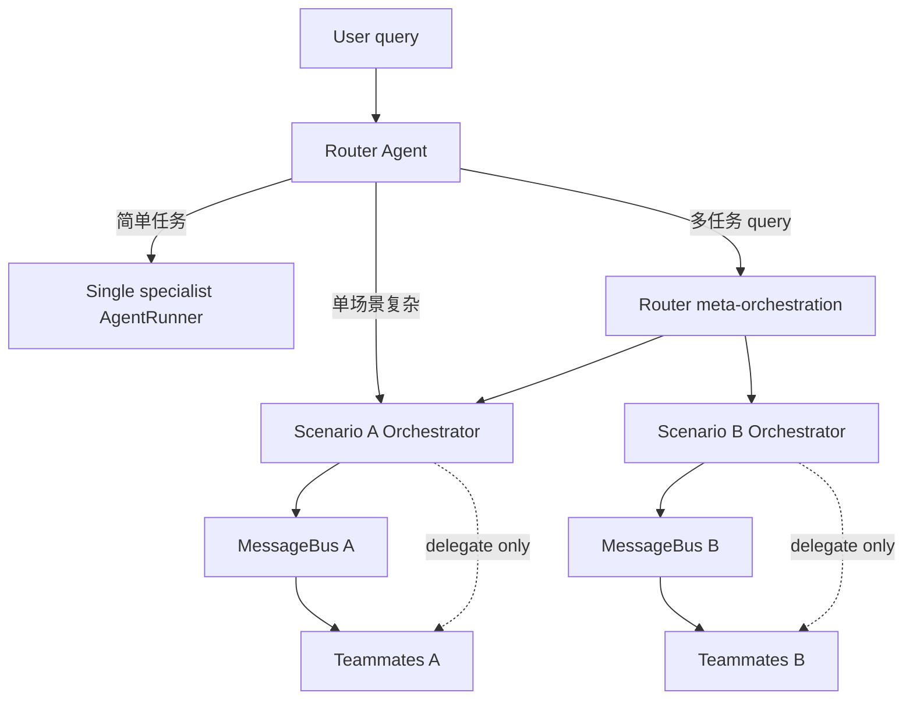

# Phase 11 — Agent Team Architecture

> State: Implemented
> Plan: `docs/superpowers/plans/2026-05-27-phase-11-scenario-teams.md`
> 本文是 **业务场景 + agent-team + 动态编排** 的单一真源。M4（`phase-10*`，固定 pipeline）为已实现的 MVP；本 spec 定义目标态与演进路径。

## 0. 一句话

每个**业务场景**对应一组 **agent-team**（只读编排者 + 可写 Teammate）；**入口 Router** 用 LLM 决定走单 agent、单场景 team，或**跨场景并行**多 team；工具由 YAML 分层声明，**全局唯一 tool 名**，编排者仅能用读类与 **MessageBus / 派任务** 类 tool。

## 1. 对齐与现状

| 能力 | 当前（已实现） | 本 spec 目标态 |
|------|----------------|----------------|
| 入口路由 | Phase 6：`router` → 单 specialist | LLM 路由 + 可选多场景并行 |
| Team | Phase 10：固定 `pipeline` + MessageBus | 场景内 **动态派活** + delegate tool |
| 编排者只读 | 未建模角色 | orchestrator 角色模板 + tool 限制 |
| 通用/专属 tool | 每 agent 独立 `tools:` | `common` + `scenario` + `member` 合并 |
| 场景标识 | team `meta.name` | **`scenario_id` 固定** + **`display_name` 本地化** |

**保留：** 简单任务继续 **单 agent 专家**（`router → web_researcher` 等），与 team **并存**。

## 2. 架构

### 2.1 两层入口 + 两种运行模式



| 模式 | 触发条件 | 行为 |
|------|----------|------|
| **A — 单场景** | LLM 判定一个 `scenario_id` 即可覆盖 | Router → 该场景 **Orchestrator** → 场景内动态派活 Teammate |
| **B — 跨场景** | LLM 判定一个 query 含多个可独立子任务 | Router **拆子任务** → **默认并行** 启动多个 scenario team → Router **仅汇总各 team 的 `summary.md`**（LLM 合成，无 tool、不读 artifact/trace 全文） |

**模式 B 说明：** Router 在此扮演 **跨场景 meta-orchestrator**，**不替代** 各场景内 Orchestrator；每个 team 仍有自己的只读编排者与 Teammate。

### 2.2 角色与副作用边界

| 角色 | 职责 | 允许的工具类型 | 禁止 |
|------|------|----------------|------|
| **Router** | 选场景、拆多任务、降级单 agent、跨场景汇总 | 路由元数据、读 catalog、`team.delegate`（跨场景）、MessageBus（若需） | filesystem/terminal/http 写/browser submit 等副作用 tool |
| **Orchestrator** | 知悉 Teammate 列表；**动态派活**；跟踪 Bus | `team.delegate`、MessageBus、可选 `filesystem.read`、读 trace | 任何直接改 workspace 的 tool |
| **Teammate** | 执行子任务；产出 artifact | 按角色 YAML：读 + 写 + **场景专属** tool | 其他场景的专属 tool |
| **Single specialist** | 简单任务一站式 | 现有 agent yaml | — |

**已确认：** 「只读」**不**包含禁止 MessageBus / 派任务；**包含**禁止副作用型原子 tool。

### 2.3 动态派活（非固定 pipeline）

- Phase 10 的 `team.pipeline` 保留为 **demo / 测试捷径**，非主路径。
- 主路径：Orchestrator 在 agent loop 中反复：**观察（Bus / 上轮输出）→ `team.delegate` → 等待 Teammate run 完成 → 再决策**，直至完成或触达上限。
- 所有 delegate 必须产生 trace：`scenario_id`、`message_id`、`sender`、`receiver`、`task_ref`。

**护栏（实现时必须）：**

| 护栏 | 建议默认值 |
|------|------------|
| 最大 delegate 轮次（per orchestrator run） | 配置项，如 `runtime.max_delegations` |
| 单 Teammate max_turns | 沿用各 member agent `runtime.max_turns` |
| 重复 delegate 检测 | 相同 `(receiver, task_hash)` 拒绝或 warning |
| Teammate `confirm` | Team run **挂起**；Orchestrator **不能代批**；UI 展示 `scenario_id` + member |

### 2.4 跨场景并行（模式 B）

- **默认：并行** 启动各 `scenario_id` 的 team run（独立 `run_id` / trace）。
- 每个 team run 结束时由 Orchestrator / team runner 写入 **`summary.md`**（与现有 `RunTrace.write_summary` 一致）。
- Router 汇总：**只读取** 各并行 team run 的 **`summary.md` 内容**（经内部 API/store，非 filesystem tool），交给 LLM 合成对用户的最终回复；**不**拉取 trace 全文、artifact、Bus 历史。
- 需定义：并行 run 与 **chat `session_id`** 的关联结构（父 run / `correlation_id`）。

## 3. 业务场景（Scenario）

### 3.1 标识

| 字段 | 规则 |
|------|------|
| **`scenario_id`** | 稳定、全局唯一、ASCII（如 `research-report`）；用于路由、trace、API、目录名 |
| **`display_name`** | 本地化展示名（如 `研究报告`）；UI/API 展示，**不参与**路由键 |
| **`description`** | 可选；供 Router LLM 选型 |

### 3.2 配置布局（建议默认）

```text
configs/
  agents/
    router.yaml
    web_researcher.yaml          # 单 agent 专家（并存）
  tools/
    common.yaml                  # 通用 tool 声明（全局唯一名）
  scenarios/
    research-report/
      scenario.yaml              # id, display_name, description, entry
      orchestrator.yaml          # 编排者
      members/
        researcher.yaml
        writer.yaml
      tools.yaml                 # 场景专属 tool（全局唯一名）
  teams/                         # 可选：保留 phase-10 pipeline 示例
    research_report.yaml
```

**`scenario.yaml` 示例：**

```yaml
id: research-report
display_name: 研究报告
description: 调研来源并撰写 Markdown 报告
entry: orchestrator.yaml
# 可选：显式声明并存降级（Router LLM 仍为主要决策）
single_agent_fallback: web_researcher.yaml
```

### 3.3 Tool 合并与命名

**已确认：tool 名全局唯一**（如 `filesystem`、`http`、`research.fetch_source`）。

```text
member 有效工具 =
  merge(common.tools, scenario.tools, member.tools)
  ∩ PermissionGuard(角色模板：orchestrator | teammate)
```

| 来源 | 作用域 |
|------|--------|
| `configs/tools/common.yaml` | 所有场景、所有 agent 的基线（启用与否可由角色覆盖） |
| `configs/scenarios/<id>/tools.yaml` | **仅该 scenario** 下 member 可引用 |
| `members/<role>.yaml` 内 `tools:` | 角色级覆盖 |

专属 tool 不得被其他 scenario 的 agent 启用；loader 应在校验期报错或 fail-closed。

## 4. 协作原子：`team.delegate`

**新原子 tool（非业务流程 adapter）：**

| 属性 | 值 |
|------|-----|
| tool 名 | `team`（或全局唯一名 `team.delegate` 映射为 `tool=team`, `operation=delegate`） |
| operation | `delegate` |
| target | JSON：`receiver_member_id`, `task`, `context_ref?` |
| 执行 | 经 MessageBus 投递 → 启动/恢复 Teammate `AgentRunner` → 结果回 Bus |

Orchestrator / Router（模式 B）可注册此 tool；Teammate 默认不注册（除非角色为嵌套编排，本期不做）。

## 5. Router 决策（LLM）

**已确认：由 LLM 自行决定**（非硬编码规则表为主）：

1. **单 agent**：任务简单，一个 specialist 即可 → `target_agent` + `delegated_task`（沿用 Phase 6 协议扩展）。
2. **单场景 team**：复杂但属同一业务 → `scenario_id` + 交给 Orchestrator。
3. **多场景**：一个 query 多个子任务 → 拆分为 `{ scenario_id, subtask }[]`，**默认并行** 执行。

Router 输出需结构化（JSON schema / tool call），并写入 routing trace：`decision_kind`, `scenario_id?`, `parallel_groups?`, `reason`。

**降级（已确认）：** Router LLM 低置信度或未匹配任何 specialist/scenario 时 → **`general_assistant`**。

**`general_assistant` 边界：** 对超出其能力边界的任务，**直接回复用户「做不到」**（说明原因/缺失能力），不强行调用 tool、不假装完成。需在 `configs/agents/general_assistant.yaml` 的 system_prompt 中明确，并有单测/scripted LLM 用例覆盖。

## 6. 与 Phase 10 的关系

| Phase 10 产物 | 演进 |
|---------------|------|
| `team/bus.py` | **保留**，作为 delegate 底层 |
| `team/runner.py` pipeline | **保留测试**；新增 `team/orchestrator_runner.py`（名称待定） |
| `config/team_schema.py` | **扩展**或新增 `scenario_schema.py` |
| `configs/teams/*.yaml` | 迁移到 `configs/scenarios/<id>/` |

## 7. 测试需求集

1. Orchestrator 无 `filesystem.write` 注册时，LLM 若发起 write → guard deny / tool 未注册。
2. `team.delegate` 产生 `team_message_sent` / `team_message_received`，含 `message_id` 与 `scenario_id`。
3. 动态派活：scripted LLM 连续 delegate 两个 member，最终 `run_completed`。
4. 重复 delegate 同 task → 护栏触发。
5. Router LLM 返回并行两组 scenario → 两个 team run 均产生 trace（并行）；Router 汇总输入 **仅** 为两路 `summary.md` 文本。
6. 单 agent 路径：Router 选 `web_researcher` → 不启动 team。
7. 场景专属 tool 名在 scenario A 启用、scenario B agent 配置中出现 → loader 失败或 runtime deny。
8. Router fallback → `general_assistant`；超边界任务 → 最终回复含「无法完成」语义且无 tool_executed。

## 8. 测试与门控

- 实现阶段：`python -m pytest tests/unit -v` 不得破坏 Phase 0–10 已有测试。
- 新包建议：`tests/unit/scenarios/`、`tests/unit/team/test_orchestrator*.py`。

## 9. 一页交接

| 项 | 内容 |
|----|------|
| **决策来源** | 2026-05-27 对话：两层入口、编排者 Bus/delegate、动态派活、单 agent 并存、scenario id + 本地化 display_name、并行默认、LLM 路由、全局唯一 tool 名 |
| **实现完成** | 2026-05-27；`python -m pytest tests/unit -v` → **121 passed** |
| **勿做** | 第一版不上分布式 Bus、不上 Orchestrator 代批 confirm、不让 Router 直接写 workspace；模式 B 汇总不读 artifact/trace 全文 |

## 10. 当前 TODO（按优先级）

### P0 — 契约与配置

- [x] `ScenarioCatalog`：`scenario_id` → paths、`display_name`、`orchestrator`、`members`
- [x] `configs/tools/common.yaml` + scenario `tools.yaml` merge 规则（`tool_merge.py` / `role_templates.py`）
- [x] 角色模板：`orchestrator` / `teammate` 默认 deny/enable 集

### P1 — 运行时

- [x] `team.delegate` adapter + MessageBus 集成（`scenario_id` on messages）
- [x] `OrchestratorRunner` 动态派活循环 + 护栏（`max_delegations`、重复 delegate）
- [x] Trace 事件：`scenario_id` / `message_id` on delegate 与 teammate 事件

### P2 — Router

- [x] 扩展 routing 协议：`decision_kind` = `single_agent` \| `scenario` \| `multi_scenario` \| `fallback`
- [x] 多场景 **默认并行** + `correlation_id`（`multi_scenario.py`）
- [x] Router 汇总：**仅** 各 team run 的 `summary.md` → LLM 合成回复
- [x] Fallback → `general_assistant`；更新 general_assistant prompt（超边界直说做不到）

### P3 — 迁移与文档

- [x] `configs/scenarios/research-report/` 示例
- [x] `run_chat` 集成 scenario / multi_scenario（`chat.py` + `ScenarioAwareRoutingResolver`）
- [x] `docs/superpowers/plans/2026-05-27-phase-11-scenario-teams.md` 工作包拆分

## 12. 实现交接（2026-05-27）

| 模块 | 路径 |
|------|------|
| Scenario 加载 | `config/scenario_schema.py`, `config/scenario_catalog.py` |
| Tool 合并 / 角色 | `config/tool_merge.py`, `config/role_templates.py`, `configs/tools/common.yaml` |
| Delegate | `tools/team_delegate.py`, `team/bus.py`, `permissions/guard.py`（`team.delegate` allow） |
| 动态编排 | `team/orchestrator_runner.py` |
| 多场景并行 | `routing/scenario_resolver.py`, `runtime/multi_scenario.py`, `routing/decision.py` |
| Chat 入口 | `runtime/chat.py`, `routing/resolver.py`（`ScenarioAwareRoutingResolver`） |
| 示例场景 | `configs/scenarios/research-report/` |

**测试：** `tests/unit/scenarios/`, `tests/unit/team/test_orchestrator_runner.py`, `tests/unit/tools/test_team_delegate.py`, `tests/unit/routing/test_multi_scenario.py`, `tests/unit/routing/test_general_fallback.py`, `tests/unit/runtime/test_chat_scenario.py`

**未做（后续）：** LiteLLM Router 结构化输出 scenario / multi_scenario（当前规则路由 + 离线测试）；场景专属 tool 运行时校验跨 scenario 引用；Orchestrator 代批 confirm。

## 11. 已确认决策摘要

| # | 决策 |
|---|------|
| 1 | 编排者可用 MessageBus / 派任务类 tool |
| 2 | 默认两层；多任务时 Router 跨场景拆任务（meta-orchestrator） |
| 3 | 场景内 **动态派活**（非固定 pipeline 主路径） |
| 4 | 配置目录采用 §3.2 默认布局（无用户偏好） |
| 5 | 单 agent 专家 **并存** |
| 6 | **`scenario_id` 固定** + **`display_name` 本地化** |
| 7 | 跨场景子任务 **默认并行** |
| 8 | 简单/复杂/多场景由 **LLM** 决定 |
| 9 | Tool 名 **全局唯一** |
| 10 | 模式 B 汇总 **仅用各 team 的 summary** |
| 11 | Fallback **`general_assistant`**；超边界 **直接回复做不到** |
