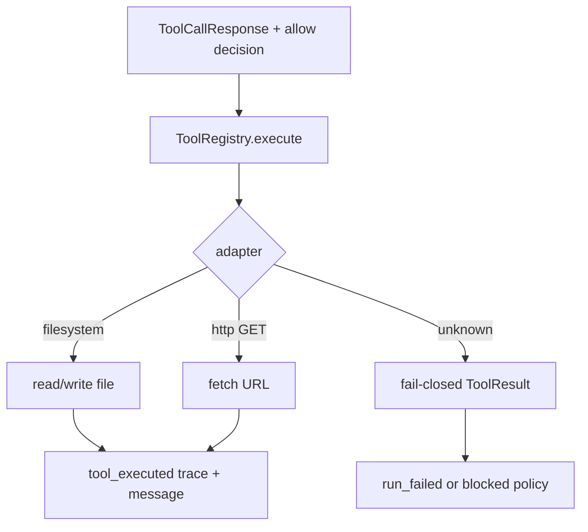

# Phase 2 Tool Registry Spec

> State: Implemented
> Updated: 2026-05-27
> This spec is the durable handoff for atomic tool registration and minimal safe adapters behind `PermissionGuard`.

## 0. Goal

Introduce a `ToolRegistry` that dispatches allowed tool calls to atomic adapters. Replace Phase 1 `tool_skipped` events with real execution for filesystem and HTTP GET inside existing sandbox rules. Keep `AgentRunner` thin: permission first, then registry dispatch, then trace + message feedback.

## 1. Scope

In scope:

- `ToolAdapter` protocol and `ToolResult` dataclass.
- `ToolRegistry` with enabled-tool filtering and fail-closed dispatch.
- `FilesystemTool`: `read` and `write` inside workspace resolution (permission already enforced).
- `HttpTool`: `GET` only, domain allowlist enforced by guard; injectable fetcher for tests.
- `AgentRunner` invokes registry on `allow` decisions and records `tool_executed` events.
- Optional `content` on `ToolCallResponse` for write payloads.

Out of scope:

- Real terminal execution (remains confirm-only at guard; no bypass).
- Real browser automation (stub/unregistered until a later phase).
- User confirmation UI.
- Multi-step workflow tools.

## 2. Main Flow



## 3. File Responsibilities

| File | Responsibility |
|------|----------------|
| `src/agent_factory/tools/base.py` | `ToolResult`, `ToolAdapter` protocol |
| `src/agent_factory/tools/registry.py` | Registry dispatch and default builder |
| `src/agent_factory/tools/filesystem.py` | Sandbox-resolved read/write |
| `src/agent_factory/tools/http.py` | HTTP GET with injectable fetcher |
| `src/agent_factory/runtime/runner.py` | Call registry after allow |
| `tests/unit/tools/` | Adapter and registry tests |
| `tests/unit/runtime/test_runner.py` | End-to-end runner with real filesystem writes |

## 4. Key Decisions

- Permission checks stay in `PermissionGuard`; adapters must not re-implement policy except for operational safety (e.g. HTTP method normalization).
- HTTP tests use an injected fetcher; production uses stdlib `urllib`.
- `ToolCallResponse.content` carries write body text; empty string creates an empty file.
- Terminal and browser are not executed in this phase; guard confirm/deny behavior is unchanged.

## 5. Tests

Implemented tests:

1. Registry dispatches to registered adapter.
2. Registry returns error for unknown/disabled tool name at dispatch time.
3. Filesystem write creates file; read returns content.
4. Filesystem read fails clearly for missing file.
5. HTTP GET returns fetcher body in tests.
6. Runner completes after allowed filesystem write and records `tool_executed`.
7. Runner fails when tool execution fails after allow.
8. Runner still blocks on confirm/deny unchanged.

Verification:

```bash
python -m pytest tests/unit -v
```

Last known result:

```text
31 passed
```

## 6. Handoff

After Phase 2, Phase 3 should wire a fake or real LLM with HTTP/filesystem in the web research demo and write artifacts under `.agent-factory/runs/<run_id>/`.
