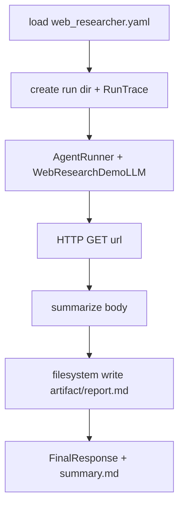

# Phase 3 Web Research Demo Spec

> State: Implemented
> Updated: 2026-05-27
> This spec is the durable handoff for the first end-to-end demo: fetch a page, summarize, and write a Markdown artifact under a run directory.

## 0. Goal

Deliver a callable web research demo that loads `configs/agents/web_researcher.yaml`, runs the existing `AgentRunner` with a message-aware fake LLM, fetches an allowlisted URL via HTTP GET, writes `artifact/report.md` under `.agent-factory/runs/<run_id>/`, and records trace plus `summary.md`.

## 1. Scope

In scope:

- `run_web_research_demo()` orchestration API.
- `WebResearchDemoLLM` that scripts http GET → filesystem write → final answer based on tool feedback in messages.
- Deterministic `summarize_web_content()` (no real model provider).
- Injectable HTTP fetcher for tests.
- Unit/integration tests for happy path and blocked domain.

Out of scope:

- Real LLM providers.
- Browser automation execution.
- CLI entrypoint (optional later).
- Scheduling and notifications.

## 2. Main Flow



## 3. File Responsibilities

| File | Responsibility |
|------|----------------|
| `src/agent_factory/llm/web_research_demo.py` | Message-aware fake LLM for demo script |
| `src/agent_factory/runtime/summarize.py` | Deterministic Markdown summarizer |
| `src/agent_factory/runtime/web_research.py` | Demo orchestration and result types |
| `tests/unit/runtime/test_web_research.py` | Demo integration tests |

## 4. Key Decisions

- Reuse `AgentRunner`, `PermissionGuard`, and `ToolRegistry`; do not bypass permissions.
- Report path is `.agent-factory/runs/<run_id>/artifact/report.md` relative to workspace root.
- Summarization is a pure function for reproducible tests, not a hidden multi-step tool.

## 5. Tests

1. `WebResearchDemoLLM` issues GET then write after seeing HTTP body in messages.
2. `summarize_web_content` produces Markdown with source URL.
3. Happy-path demo writes report, trace, and summary under run directory.
4. Demo fails closed when URL domain is not allowlisted.

Verification:

```bash
python -m pytest tests/unit -v
```

Last known result:

```text
35 passed
```

## 6. Handoff

After Phase 3, Phase 4 should add post-run memory candidates and skill drafts without auto-enabling skills.
